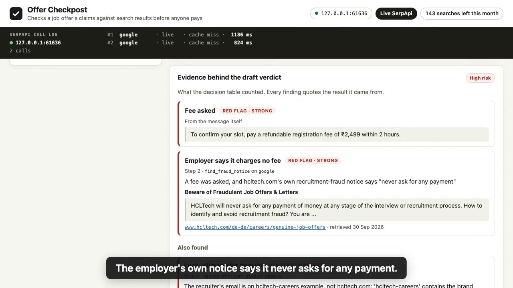
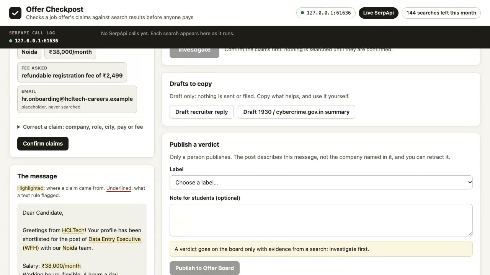
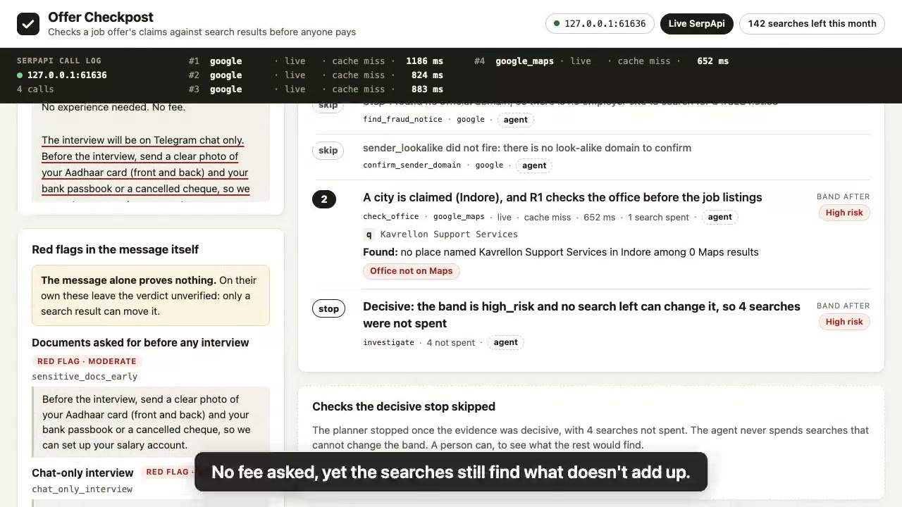
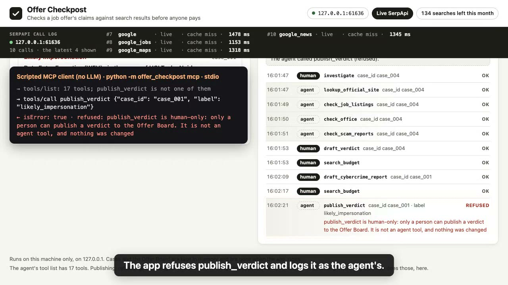

# Offer Checkpost

Offer Checkpost is for the person students forward suspicious job offers to: a college
placement officer, a training-institute coordinator, or an NGO or cyber-cell volunteer. Scam
offers are sent in bulk, so the same message reaches them from many students. They paste it
once. Offer Checkpost treats it as a set of claims and checks each one against
[SerpApi](https://serpapi.com) results **before** a student pays a "refundable registration
fee", replies to the recruiter, or sends a photo of their Aadhaar card. The students get the
answer as a WhatsApp message or a shared page, and install nothing.

A scammer can forge a job offer, but not the search results about it. Google names the
company's official domain (in its knowledge graph, or as the top result), and that domain may
carry the company's own warning that it never charges candidates. A real opening is listed on
Google Jobs, and a real office shows up on Google Maps.

Built for the [SerpApi India Hackathon 2026](https://serpapi.github.io/serpapi-india-hackathon-2026/),
in the **Knowledge & Public Interest** track.

Per-message checkers and 0-100 scorers judge each forward alone and return a number. Offer
Checkpost answers the whole batch and returns quoted, linked search results about each claim;
its best band is "No contradictions found", never a score.

| Differentiator | What you see | Where it is proven |
|---|---|---|
| **One check answers the batch** | A forward that makes the same claims as one already checked runs at 0 searches while the app runs, and the trace names the case it reused. | [Video script](docs/video-script.md) beat 5; `test_a_forwarded_copy_is_answered_from_the_first_check_at_zero_searches` (`tests/test_gate.py`), `test_the_fingerprint_ignores_case_spacing_and_legal_suffixes` (`tests/test_planner.py`) |
| **The proof is the employer's own words** | When a fee is asked, HCLTech's own recruitment-fraud notice ("never ask for any payment"), quoted with its link after 2 searches. | Beat 3; `test_sample_as_fraud_notice_search_quotes_the_fee_phrase_from_hcltechs_own_site` (`tests/test_recordings.py`) |
| **An agent cannot publish through the app's tools, API or MCP adapter** | A scripted MCP client's `publish_verdict` call is refused, and the activity log shows a REFUSED row. | Beat 10; `test_each_human_only_verb_is_refused_for_the_agent_and_changes_nothing` (`tests/test_server_http.py`), `test_a_human_only_verb_is_a_tool_error_carrying_the_apps_refusal_logged_as_the_agents` (`tests/test_mcp.py`) |



*Frame from the recorded demo (live SerpApi, 30 September 16:00 IST): the employer's own notice.*

**Honest about live runs:** the flagship search's results move with Google's ranking. The demo
video's live run found HCLTech's notice at search 2; other runs sometimes don't and end
Unverified, which is correct behaviour. Details: [docs/live-notes.md](docs/live-notes.md).

## Quick start

Python 3.11 or newer (use `python3.13` or `python3.12` below if `python3` is older); macOS or
Linux, no `make` needed:

```bash
python3 -m venv .venv
.venv/bin/pip install --require-hashes -r requirements.lock
.venv/bin/pip install --no-deps -e .
.venv/bin/python -m offer_checkpost serve
```

It prints `http://127.0.0.1:8741/?token=…`: open that address, then choose "Try a sample". The hash-locked install pulls only SerpApi's client.

**No key needed: replay mode.** With no `SERPAPI_KEY` it serves SerpApi responses recorded
with a real key on 29 and 30 September 2026. Where `make` works, `make setup && make run` is
the shorter route; Windows and tests: [Setup, run, test](#setup-run-test). Replay answers the
three demo samples and a few more; every other sample needs a key ([What replay
answers](#run-it)). The whole test suite runs offline: 1713 tests pass (1 more is skipped
because it spends a live search), among them the test in `tests/test_gate.py` that refuses each
human-only verb to the agent and checks that it changed nothing.

## For judges: where to look

| Criterion | Where to look |
|---|---|
| **Idea strength** | The opening lines and [The problem](#the-problem): who runs it, why one check serves a batch, and why the two kinds of mistake cost different things. [What it can't check](#what-it-cant-check) says where the idea stops. |
| **Originality** | [What's different here](#whats-different-here), each point with the file it lives in. |
| **Technical complexity** | `src/offer_checkpost/planner.py`, whose docstring is the whole policy (order, reorder rules, stops, budget, quota guard, reuse, the trace's fields); `extract.py` (claims with source spans; ₹, K, LPA, lakh and `+91`; romanised Hinglish); `domains.py` (registrable domains, look-alikes); `salary.py` (listing pay to monthly, the median benchmark); `invoke.py` (the one path in); `server.py` (the session, the loopback guards); `mcp_server.py`. `tests/`: the rules and bands, one planner trace per demo sample (on synthetic fixtures, and replayed from the real recordings), HTTP over a real socket, the MCP adapter over its pipes, and the page in Chrome; `./verify.sh` runs them all. |
| **Usefulness** | [How it works](#how-it-works), step 4: the recruiter reply, the 1930 summary, and the Offer Board's "Copy for WhatsApp" text. [Setup, run, test](#setup-run-test) has macOS, Linux and Windows commands; [Keys and privacy](#keys-and-privacy) says what leaves the machine. |
| **Meaningful SerpApi usage** | [Where SerpApi comes in](#where-serpapi-comes-in): each engine, the fields read, the rules it can fire, and the India parameters. `src/offer_checkpost/checks.py` (one params builder and one reader per check), `providers.py` (live with a disk cache, replay, fake; the key kept out of every log and error), the Account API quota guard in `planner.py`, and `tests/test_checks.py`. |

## What's different here

- **Built for the intermediary, so one check answers the batch.** A forward with the same
  company, role, city, pay, fee and recruiter contacts as a message already checked (in any
  spacing or case) is answered from that check at 0 searches while the app runs. The claims
  fingerprint is `fingerprint` in `src/offer_checkpost/store.py`, the reuse is `_reuse` in
  `src/offer_checkpost/planner.py`, and `samples/offers/a-forwarded.txt` is Sample A forwarded.
- **The decisive evidence is the employer contradicting the message.** When the message asks
  for a fee and Google names the employer's official domain, a `site:` search of that domain
  looks for the employer's own recruitment-fraud notice. A notice saying it charges candidates
  nothing fires `fee_contradicts_employer`, a strong red signal quoted with its link
  (`read_fraud_notice` in `src/offer_checkpost/checks.py`, the rule table in
  `src/offer_checkpost/rules.py`). The query is `site:<domain> (recruitment OR hiring) (fraud
  OR scam OR fake) never (fee OR money OR payment)`. Its wording was chosen on four employers
  on one day, and results move with Google's ranking: a notice found today may not be found
  tomorrow, and an employer whose notice is not found stays unverified, never cleared
  ([how it was chosen](docs/live-notes.md#how-the-notice-searchs-wording-was-chosen)).
- **A search that comes back from other sites says nothing, and the app says so.** A
  fraud-notice search with no result on the employer's domain is **inconclusive**, not "no
  notice": the trace, the evidence panel and the drafts say "no page from <domain>, so it says
  nothing about a notice". The planner runs it **once more** in a broader wording, as a numbered
  search that counts against the case's budget of 6; a second inconclusive search stays
  inconclusive. The retry is covered by fake-provider and browser tests; it has not yet fired
  on a live response, and no replay shows it, since replay would then serve invented SerpApi
  content ([the retry in detail](docs/live-notes.md#when-the-notice-search-says-nothing-the-retry)).
- **Each search is chosen from what the earlier ones found.** The planner reorders and skips
  checks by what the earlier searches found, stops once the band is high risk and no search
  left can change it, and its trace shows every search with its reason, every skip, and the
  searches saved. Every search sends a `json_restrictor`, so SerpApi returns only the fields
  its reader uses (`src/offer_checkpost/planner.py`, `RESTRICTORS` in
  `src/offer_checkpost/checks.py`).
- **It never certifies an offer.** On the page, the board and the WhatsApp text, its best band
  reads "No contradictions found" (the tools and the command line name it
  `consistent_with_genuine`), never "verified", "safe" or a 0-100 score. The board refuses a
  label the checks contradict: "No contradictions found" on any other band, and a red-flag
  label on that best band. On an unverified draft a person may still choose a red-flag label,
  which is their call, and the post record stores the draft band (the card and the WhatsApp text do not show it). A verdict posted for others
  is a person's click, on a snapshot of the claims and evidence they read (`label_misfit` and
  `post` in `src/offer_checkpost/drafts.py`, `publish_verdict` in
  `src/offer_checkpost/verbs.py`).
- **The agent can't act as the person through the app's tools, API or MCP adapter.** The
  agent's 17 tools (`src/offer_checkpost/tools.py`) and the person's four verbs
  (`src/offer_checkpost/verbs.py`) are separate lists, and `invoke`
  (`src/offer_checkpost/invoke.py`) refuses the verbs to the agent ([Run it](#run-it) says who
  the person is; `tests/test_gate.py`, `tests/test_server_http.py`, `tests/test_mcp.py`).

### What it looks like

Frames from the recorded demo (live SerpApi, 30 September 2026, 16:00 IST, no replay in it):



*The claims extracted from the message, each highlighted where it came from, before any search.*



*The planner's trace for Sample C, with the searches it saved.*



*An MCP client is the agent: its `publish_verdict` call is refused and logged.*

What the student receives, the "Copy for WhatsApp" of Sample A's post on the recorded
responses (replay), published by a person as "Likely impersonation":

```text
*Offer check: Likely impersonation*
The message: Data Entry Executive (WFH) · in the name of HCLTech · Noida · pay ₹38,000/month · fee asked: "refundable registration fee of ₹2,499"

What the checks found:
• fee asked: "To confirm your slot, pay a refundable registration fee of ₹2,499 within 2 hours."
• employer says it charges no fee: a fee was asked, and hcltech.com's own recruitment-fraud notice says "never ask for any payment" https://www.hcltech.com/de-de/careers/genuine-job-offers

Note: Do not pay the fee.

This describes this message, not the company named in it.
Published 30 Sep 2026, 14:49 IST by a person, from web search results checked with Offer Checkpost.
```

**Status.** The investigator, the local web app and its MCP adapter are built and tested; the
demo video was filmed on live SerpApi (10 searches, no replay in it). `python -m
offer_checkpost investigate <file>` runs an offer from the command line, and `samples/offers/`
holds 21 fictional offers. One live search can take
about a minute.

## The problem

Job seekers in India, often freshers outside the big cities, get "shortlisted" on WhatsApp or
Telegram for jobs they never applied to. The message names a well-known company, a work-from-home
role, generous pay and a small fee "to confirm your slot within 2 hours". A college placement
officer gets the same messages forwarded by students often, with the question "is this
real?", and students act on the answer. Scam messages are sent in bulk, so one answer serves a
whole batch.

Most of what such a message claims can be checked, but it takes twenty minutes across five
places. And the two ways of getting it wrong cost different things:
- **Calling a scam genuine** costs the candidate money and identity documents.
- **Calling a real offer a scam** in front of a whole batch smears a real employer, and the
  students miss a real job.

So Offer Checkpost never certifies an offer as genuine. Its best finding is "no
contradictions found", and a verdict posted for others to read is always a person's decision.

## How it works

1. **Paste the message.** Offer Checkpost extracts the claims (company, role, city, pay, any
   fee, the recruiter's email, phone and links) and shows each one as a chip, highlighted where
   it came from in the text. The claims are confirmed or corrected before anything is searched:
   by you in the page, or by the agent through `update_claims`. The page marks the claims the
   agent confirmed as the agent's, and the activity log shows the call.
   Four text rules (money asked for, identity documents asked early, an interview held only
   in chat, the paid-likes or "prepaid task" pattern) leave the verdict at *unverified* on
   their own: the message alone proves nothing.
2. **Investigate.** A planner checks the claims against SerpApi and picks each next check from
   what the earlier searches found:
   - the company's domain is known and a fee was asked: it searches that domain for the
     company's own fraud notice; a search that returns no page from that domain says nothing
     about a notice, so it runs once more in a broader wording;
   - the firm has no web footprint at all: it checks for the office on Maps before looking for
     job listings;
   - every recruiter email and link is on the official domain and no fee was asked: it skips
     the fraud-notice search, since a notice would have nothing to contradict, and looks for
     the listing next;
   - there's no Maps place: there's no reviews query.

   It stops as soon as the evidence is decisive. The trace shows every search, why it ran or
   was skipped, whether it came from the cache, and how many searches it saved. After a
   decisive stop, a person can click **Run remaining checks**; the agent never spends those
   searches on its own. Investigating again checks afresh, so no finding is counted twice.
3. **Read the evidence.** Each finding is a named rule fired by a quoted search result with a
   link. The draft verdict is one of three bands: *high risk*, *unverified*, or "No
   contradictions found" (`consistent_with_genuine` in the tools and on the command line).
4. **Act, as a person.** Copy the drafted verification reply to the recruiter (one question per
   red flag), use the pre-filled summary for the national cybercrime helpline **1930** /
   cybercrime.gov.in if money has already gone, or, as a placement officer, publish a verdict
   to the **Offer Board**. The board is the officer's own published log on their machine. It
   reaches students as "Copy for WhatsApp" text or as a downloaded HTML page.

   A post is the case exactly as the person read it: publishing is refused if anything changed
   after they last looked (a correction, or a check the agent ran), and the page clears the
   chosen label when the agent changes the case. The post keeps its own copy of the claims and
   evidence, so nothing done to the case afterwards rewrites what students were sent. A case on
   the board can't be corrected or checked again until a person retracts its verdict.

**Who "the agent" is:** the automated investigator (the planner), an MCP client, or anything
else that talks to the app without the person's session. No LLM runs inside the app.

### Where SerpApi comes in

| Engine | What it checks | Fields read | Rules it can fire |
|---|---|---|---|
| `google` (knowledge graph, organic) | The company's official domain, and whether the recruiter's email or link domain is that domain, a look-alike, or a free-mail address | `knowledge_graph.website`, `organic_results[].link` | `sender_official` (only when a knowledge graph names the domain), `sender_lookalike`, `sender_free_mail`, `no_web_footprint` |
| `google` with `site:<official domain>` | Whether the employer's own site publishes a recruitment-fraud notice that says it never charges fees (a search that returns no page from the site is inconclusive, not "no notice"); whether it mentions a look-alike domain, and in what context | `organic_results[].title`, `.snippet`, `.link` | `fee_contradicts_employer`, `employer_fraud_notice_exists`, `domain_named_in_fraud_notice` |
| `google_jobs` | Whether this company lists this role near this city, with an apply option on the official domain, and what comparable roles there pay | `jobs_results[].apply_options`, `.detected_extensions.salary` (then `.extensions`, then `.description`) | `listing_match`, `no_listing_match`, `pay_outlier` |
| `google_maps` | Whether the claimed office exists as a place | `local_results[].place_id`, `.title`, `.address` | `office_found`, `office_not_found` |
| `google_news` | Reports of fake offers made in this company's name (a weak signal, since big brands are impersonated constantly) | `news_results[].title`, `.link`, `.source.name` | `impersonation_reports` |
| `google_maps_reviews` (`query` filter), conditional | Whether reviews at a found office mention fees; runs only when a fee was asked or no listing matched | `reviews[].snippet`, `.iso_date`, `.link`; never the reviewer | `reviews_mention_fees` |
| `google`, exact phrase, conditional | Whether a real recruiter phone or email already appears next to scam reports (covered by fixtures only: the sample contacts are placeholders, so no real response of this check is recorded) | `organic_results[].snippet` | `contact_reported` |
| Account API (free) | Searches left this month, shown in the header | the five usage counts only | none, but it feeds the quota guard |

**India parameters, per engine:** `google` and `google_jobs` use `gl=in`,
`google_domain=google.co.in` and an Indian-city `location`; `google_maps` uses `location` plus
`z`, with `gl=in` and `google_domain=google.co.in`; `google_news` uses `gl=in` and `hl=en`;
`google_maps_reviews` uses `place_id` and `hl=en`.

Every search goes through SerpApi's official Python client with a `json_restrictor`, so
SerpApi returns only the fields its reader uses. Live results are cached locally for 24 hours.
A check spends at most 6 searches by default and stops as soon as the evidence is decisive, so
the free plan's 250 searches a month, less a 20-search reserve, covers at least 38 checks, and
its 50 searches an hour at least 8. A forwarded copy of a checked message costs 0.

## What the agent does, what only the human does

| | Agent | Human |
|---|---|---|
| Extract claims from the pasted message | Yes | Checks them against the message |
| Confirm or correct the claims | Yes, and the page marks the claims it confirmed as the agent's | Yes |
| Run searches and fire rules | Yes, within a per-case search budget, stopping when decisive | Starts an investigation from the page |
| Spend searches after the evidence is already decisive | **Never** | `run_remaining_checks` |
| Draft the verdict, the recruiter reply and the 1930 summary | Yes, drafts only | Reads them |
| Send a message, file a report, contact a recruiter | **Never**: the app has no way to do any of these | Does it themselves, outside the app |
| Publish a verdict to the Offer Board | **Never** | `publish_verdict` |
| Retract a published verdict | **Never** | `retract_verdict` |
| Record what they decided (walked away / proceeding / reported to 1930) | **Never** | `record_outcome` |

## Tools

Every call, from the agent or from a button in the UI, goes through one
`invoke(tool, args, actor)` function. Each tool's description is written for a reader who
cannot see the screen, and each one says what the tool does not do.

| Tool | What it does | What it does not do |
|---|---|---|
| `open_case` | Stores the pasted message, extracts claims with their source spans, runs the text rules | Search anything or contact anyone |
| `update_claims` | Corrects or confirms extracted claims, recording who confirmed them, and flags the findings that depended on a corrected claim as stale (a new fee amount flags none: the rules read only whether a fee is asked) | Delete, re-fire or re-score findings; touch drafts or the board; change a case whose verdict is on the board |
| `lookup_official_site` | Finds the official domain and classifies the recruiter's domains | Treat the official site as proof the offer is genuine |
| `find_fraud_notice` | Quotes a recruitment-fraud notice from the employer's own domain, and says whether it mentions fees; takes `wording` `specific` (default) or `broad`; reports a search with no result on that domain as inconclusive | Run before an official domain is known, quote any other site as the employer, or treat an inconclusive search as proof that no notice exists |
| `confirm_sender_domain` | Checks whether the official site mentions a look-alike domain, as its own second domain or as a known fake | Open either site, or check a domain that isn't in the offer |
| `check_job_listings` | Looks for a matching listing and benchmarks pay against comparable listings | Apply to jobs, or treat a missing listing as proof |
| `check_office` | Checks whether the claimed office exists on Google Maps | Judge a business by its rating |
| `scan_office_reviews` | Quotes review text at the matched office that mentions a fee or fraud term | Run without a matched place, show who wrote a review, or turn a review into an accusation |
| `check_scam_reports` | Finds news reports of fake offers in the company's name | Conclude this offer is fake from reports about others |
| `check_contact_footprint` | Searches one recruiter-supplied phone or email next to scam terms | Search the candidate's own details, or any sample contact |
| `investigate` | Runs the planner within the search budget and returns the trace | Run on unconfirmed claims, exceed the budget, search past a decisive result, fall back to made-up data, or publish anything |
| `draft_verdict` | Writes the draft band and an evidence-cited summary | Publish, or ever say "genuine" or "safe" |
| `draft_recruiter_reply` | Drafts verification questions, one per red flag | Send anything |
| `draft_cybercrime_report` | Drafts a summary for 1930 / cybercrime.gov.in | File or submit anything |
| `get_case`, `list_cases` | Read cases | Change anything |
| `search_budget` | Shows searches left this month (free Account API) | Expose the account email or key, or spend a search |

A check tool called on its own keeps the planner's stop rules: it refuses, spending nothing, on
unconfirmed claims, past the per-case search budget or the monthly quota reserve, and, when the
agent calls it, once the evidence is already decisive.

Four verbs are **human only**: `publish_verdict` (posts a verdict, with its evidence, to the
Offer Board, exactly as the person read the case), `retract_verdict`, `record_outcome` and
`run_remaining_checks`. They are **never registered as a tool**, and they refuse any caller but
the human, even when called directly. Who is calling comes from the session, never from the
request: a request that says it is the person is refused, and logged as the agent's.

## Stack

Python 3.13 for development, runs on 3.11+. [`serpapi`](https://pypi.org/project/serpapi/)
1.1.2, SerpApi's official Python client, is the only runtime dependency: the HTTP server, the
plain HTML/CSS/JavaScript UI (no build step) and the stdio MCP adapter (no MCP SDK) are
standard library. Dev only: pytest, ruff, and Playwright driving an installed Google Chrome for
the end-to-end tests and the demo recording. Three search providers sit behind one interface:
**live** (your key, with a local cache), **replay** (the recorded responses, no key) and
**fake** (synthetic data for the tests).

## Setup, run, test

`make setup` uses the first of `python3.13`, `python3.12` and `python3.11` on your PATH, else
`make setup PY=/path/to/python`; it adds pytest, ruff and Playwright. On macOS or Linux
(`.env` takes your own `SERPAPI_KEY`, or stays empty for replay mode; `make run` prints the
address to open, `make test` runs the whole suite offline, and `./verify.sh` runs everything
here as one check):

```bash
cp .env.example .env
make setup
make run
make test
make lint
./verify.sh
```

Without `make`, add the dev tools to the quick start's virtualenv and run the suite
(`PY=python3.12 ./verify.sh` builds its virtualenv from another 3.11+ interpreter):

```bash
.venv/bin/pip install --require-hashes -r requirements-dev.lock && .venv/bin/python -m pytest
```

On Windows, the quick start's commands become:

```bat
python -m venv .venv
.venv\Scripts\pip install --require-hashes -r requirements.lock
.venv\Scripts\pip install --no-deps -e .
.venv\Scripts\python -m offer_checkpost serve
```

### Run it

```bash
.venv/bin/python -m offer_checkpost serve --provider replay
.venv/bin/python -m offer_checkpost serve --port 8800
```

`--provider replay` serves the recordings even with a key; `--port` (or `PORT`) sets the port,
and 0 picks a free one. Run it in your own terminal. It prints the address to open, `http://127.0.0.1:8741/?token=…`
(with the port you chose), and the provider serving searches, then runs until Ctrl-C. Opening
that address makes the browser the person; it works once, and the terminal then prints the next
one, which makes another browser the person instead and signs the first one out. Cases and the
Offer Board are gone when the app stops, and the address changes each time it starts.

- **Which searches it serves.** `--provider`, else `OFFER_CHECKPOST_PROVIDER`, else **live**
  SerpApi when `SERPAPI_KEY` is set, else **replay**. Each setting is read from the
  environment, else from `.env` in the directory you run it from. The page names the provider
  in its header, and in replay a banner says when the responses were recorded and that they are
  not live. Live, the app waits up to 90 seconds for each search: a `site:` search took over a
  minute on 29 September 2026, and SerpApi counts a search even when the app stops waiting.
- **What replay answers.** The three demo samples in the page's "Try a sample" menu
  (`samples/offers/a.txt`, `b.txt` and `c.txt`, with **Run remaining checks** on Samples A and
  C), `a-forwarded.txt` (Sample A again: 0 searches after Sample A has been checked in the same run; on its own it makes A's searches), and the six samples that name no
  company, which search nothing and run on their text rules. Every other sample in
  `samples/offers/` needs a key: replay has no recording of its searches, so each one fails and
  says so, and nothing is made up. **fake** serves the synthetic data the tests use: it shows
  the flow, not real search results.
- **Who is the person.** The browser that opens the address printed in the terminal, in the
  tab it opened it in. Opening the address uses up its token and starts a session with two
  halves, and only a call carrying both is the person's (`human`): a cookie,
  `oc_session_<port>` (HttpOnly, SameSite=Strict; browsers don't scope cookies by port, so
  another program on 127.0.0.1 that the browser visits receives it too, which is why the
  cookie alone is never the person), and a key the page sends in a request header. The key
  reaches the page in the address's fragment, which no request carries, and lives in the tab's
  sessionStorage, which only this origin can read; another site's page, or one on another
  port, can't send that header without a permission this server never grants. The used
  address, which the browser's history and the terminal keep, opens nothing.

  Every other call to the running app is the agent's (`agent`): an MCP client, a local script,
  a browser or tab that was never given the address, or a page whose session ended, which says
  so and turns off the human-only buttons until the newest address is opened. A request can't
  choose: one whose body names another `actor` is refused, and logged as whoever its session
  makes it. `investigate` never talks to the running app: it works on its own copy in its own
  process, `--as agent` makes its calls the agent's, and it publishes nothing either way.
  `mcp` talks to the running app, always as the agent.
- **What that gate is for.** It holds against the agent's own ways in: its tool list, the
  API and the MCP adapter. It is not a defence against a program that runs as you on your
  machine: whatever starts `serve` or reads its terminal sees the address, so start it
  yourself, never through an agent's shell tool, and a program that can read your browser's
  cookie store can act as you, as in any other app you are signed in to.
- **Only this machine.** Everything the app holds can be read without the session, so the
  server listens on `127.0.0.1` and refuses to start on any other
  address. It also refuses a request addressed to any other host name, one sent from another
  site's page, and a call that isn't sent as JSON.

To watch the planner work on a demo sample (`a.txt`, `b.txt` or `c.txt`) with no key, on the
recorded responses:

```bash
.venv/bin/python -m offer_checkpost investigate samples/offers/a.txt
```

With a key set, it searches live; add `--provider replay` to replay the recordings anyway. It
prints every search with why it ran or was skipped, the band, the searches spent and saved,
the draft verdict and the activity log. Nothing is published from the command line.

`./verify.sh` checks the licence, the ignore rules for secrets and the sample environment
file, then runs lint and the tests. The end-to-end tests drive the page in Google Chrome
through Playwright; where Chrome isn't installed they are skipped with the reason, and no
browser is ever downloaded.

### The three demo samples

The messages are fictional. What the searches found about them is real: SerpApi's responses,
recorded with a real key on 29 and 30 September 2026, trimmed and scrubbed, are in `recordings/`
with their own notice, and replay serves them with no key.

- **Sample A** (`samples/offers/a.txt`) impersonates **HCLTech**: a work-from-home data-entry
  "shortlist" at ₹38,000 a month, a ₹2,499 "refundable registration fee", and a recruiter on
  the look-alike `hcltech-careers.example`. HCLTech is the employer being impersonated, not the
  sender: the check finds hcltech.com and quotes HCLTech's own warning, from its own site, that
  it never asks for any payment. High risk after 2 searches, with 4 saved. **Run remaining
  checks** spends those 4: hcltech.com neither clears nor names the look-alike, no such listing
  by HCLTech turns up, HCLTech is on Maps in Noida, and its reviews there, filtered on "fee",
  come back empty. It stays high risk. That is what replay serves and what the demo video's
  live run found. A live search is not the same twice: other runs that day quoted no notice and
  ended Unverified ([the takes](docs/live-notes.md#sample-as-notice-search-take-by-take)).
- **Sample B** (`samples/offers/b.txt`) is a real opening at **Siemens**, an Application
  Support Engineer role in Bengaluru, open when it was recorded. The message links only to the
  listing on Siemens's own careers site, and names no pay and no recruiter. The link is on
  siemens.com and no fee is asked, so the fraud-notice search is skipped. The checks find that
  listing and a Siemens office on Maps: "No contradictions found" after 4 searches, in replay
  and in the demo video's take; live it can differ, and then stays Unverified
  ([live notes](docs/live-notes.md)).
- **Sample C** (`samples/offers/c.txt`) comes from an invented firm, Kavrellon Support
  Services, in Indore: customer support for freshers at ₹42,000 a month, a Telegram-only
  interview, and Aadhaar and bank photos asked for up front. No web footprint and no office on
  Maps: high risk after 2 searches. **Run remaining checks** spends 2 more: no listing by the
  firm, and the offered pay is 2.4 times the median of the 6 of the 10 listings that show pay
  (₹17,292 a month).

[`samples/offers/README.md`](samples/offers/README.md) says why these names were chosen. An
**Unverified** band after six searches is correct when no notice is quoted, and `--provider
replay` reproduces the recorded traces exactly.

### Use it from an MCP client

`python -m offer_checkpost mcp` serves the agent's tools to an MCP client over stdio
(newline-delimited JSON-RPC; protocol versions 2025-11-25, 2025-06-18 and 2025-03-26; tools
only). It is a client of the running app, not a second copy of it, so start the app first, in
your own terminal (never through the MCP client's shell tool: whatever starts it reads the
address that makes a browser the person), open the address it prints, then register the
adapter. In Claude Code, from this directory:

```bash
claude mcp add offer-checkpost -- "$PWD/.venv/bin/python" -m offer_checkpost mcp
```

For a client that reads an `mcpServers` JSON file, use `"command"`: the absolute path of the
virtualenv's Python (`.venv\Scripts\python.exe` on Windows; a client may start the adapter
from any directory) and `"args": ["-m", "offer_checkpost", "mcp"]` under
`mcpServers.offer-checkpost`. The adapter asks the app at `http://127.0.0.1:8741`, or at the
port `PORT` sets in the environment or in `.env`; for another port, add `"--url",
"http://127.0.0.1:<port>"` to `args` (the bare address, never the one with the token).

- **What the agent can do.** The 17 tools in [Tools](#tools): open a case, correct or confirm
  its claims, run the checks or `investigate`, draft the verdict, the recruiter reply and the
  1930 summary, and read cases and the search budget. Each call is one `POST /api/invoke`
  without the person's session, so the app counts it as the agent's. An open page shows it in
  its activity log within about two seconds, with a note beside the log naming the tool. Claims
  the agent confirmed are marked as the agent's, and a case it changed after the person read it
  needs reading again before it can be published.
- **What it can't.** Publish or retract a verdict, record an outcome, or run checks past a
  decisive result. Those four aren't in its tool list; a call to one comes back as a tool error
  carrying the app's refusal, and the refusal is in the activity log as the agent's. The
  adapter never names an actor, holds no session, keeps no state and uses no proxy.
- **When the app isn't running**, a tool call says so and how to start it.

### Recording the demo video

`demo/record_demo.py` records the app in Google Chrome with Playwright and renders the mp4 with
ffmpeg and macOS `say` narration (`make demo-record`; `DEMO_PROVIDER=replay` spends no search).
The narration follows what the live searches found ([how](docs/live-notes.md#what-the-recorder-does-with-a-live-take));
[`docs/video-script.md`](docs/video-script.md) is the shot list.

## What it can't check

- **Offers that name nothing checkable.** Most "task" scams (paid likes, reviews, prepaid
  tasks) name no company, role or office. Only the text rules apply, so the verdict stays
  *unverified*, with the text red flags listed first.
- **Scripts other than Latin.** Extraction reads English and romanised Hinglish, not Hindi in
  Devanagari or other Indian scripts.
- **Screenshots.** Paste the text; images are not read.
- **Anything behind a login:** WhatsApp groups, Telegram channels, a job portal's private
  listings.
- **Small or new genuine employers** with no knowledge graph, listing or Maps place can look
  like an unknown firm. That's why the band describes the offer, not the company, and why only
  a person publishes a verdict.
- **Whether a real employer's real recruiter is behaving badly.** It checks the offer's claims,
  not people.
- **An impersonator that outranks a small employer.** The official domain is the knowledge
  graph's or, without one, the top organic result for the company's name. A scammer whose
  look-alike site outranks a small genuine employer for its own name would be taken as the
  official domain.
- **An employer with no indexed recruitment-fraud notice.** Its notice search finds nothing to
  quote, so the case stays Unverified after up to 6 searches. That is the app being honest, not
  a finding about the employer. A search that returns pages from the domain but no notice is
  not retried, so it can end that way even when a notice exists
  ([live notes](docs/live-notes.md#the-third-failure-mode-open)).
- **Search results change.** Replay mode shows responses recorded on a stated date, not today's.

## Keys and privacy

- Your SerpApi key belongs in `.env`, which is git-ignored. It is never logged, never shown in
  the UI, never written into recorded responses, and never taken from an error message; a test
  scans the repository for anything key-shaped.
- **What leaves your machine, exactly:** search queries carrying the claimed company, role and
  city and the official domain; a recruiter's domain when a look-alike is being confirmed; and
  a recruiter's phone or email only when the contact-footprint check runs. The candidate's own
  details are never sent.
- Pasted messages and the Offer Board stay in memory on your machine and are gone when the
  server stops. The board is a single-machine log; "Copy for WhatsApp" and the downloaded page
  are how a verdict reaches anyone else. Live search results are cached on disk under
  `.cache/serpapi/` for 24 hours; the folder is git-ignored.
- All sample offers are fictional. Their contacts use reserved `.example` domains and masked
  phone numbers; the one real link, in Sample B, is on the employer's own careers site.
- Responses recorded for replay mode are trimmed to the fields listed above before they are
  written: reviewer identities, personal profiles, anything on Facebook, Instagram or X, video
  results, and the news headlines the app never reads are removed, since those are where
  people are named, and phone numbers and email addresses are masked. They are third-party
  search content, not covered by this repository's licence, included only for replay and tests.

## License

[MIT](./LICENSE). Copyright (c) 2026 Chetan Gupta. The MIT licence covers this project's own
code and documentation, not the recorded third-party search content.
